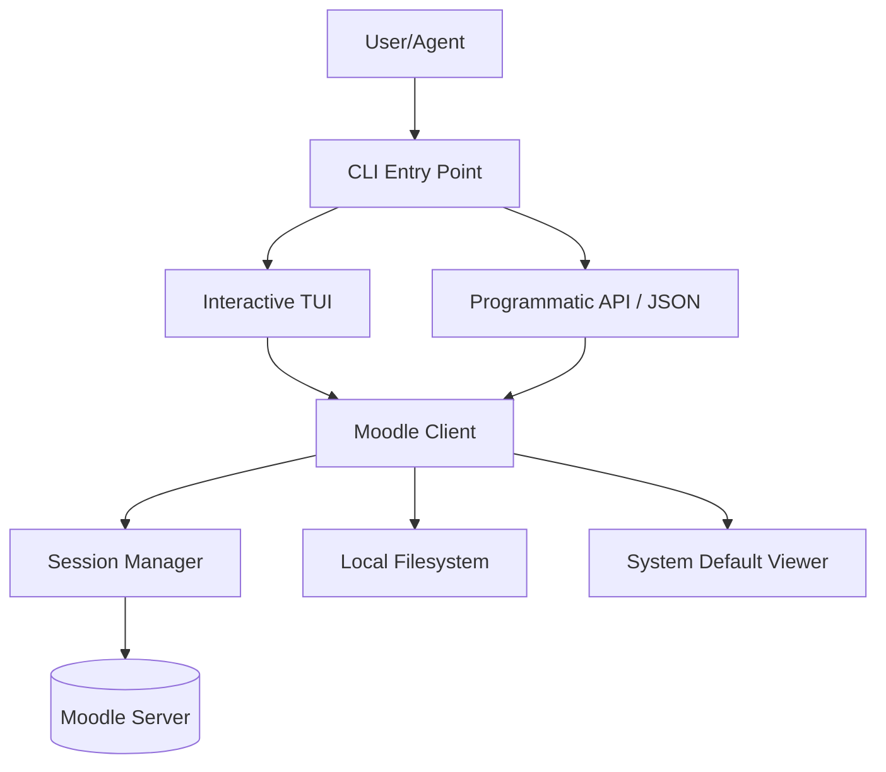

# moodli

moodli is a high-performance Moodle extraction utility and interactive terminal interface designed for academic data management. It provides a robust framework for both manual course navigation and programmatic data ingestion by automated agents.

## System Architecture

The following diagram illustrates the interaction between the moodli client, the Moodle web interface, and the local filesystem/TUI.



## Core Capabilities

- **Concurrent Extraction**: Utilizes a pooled connection model for high-speed module and course data retrieval.
- **Interactive Terminal Interface**: A dual-pane state machine built on the Bubble Tea framework for efficient course navigation.
- **Automated URL Resolution**: Transparently follows internal Moodle redirects to identify the terminal destination of resources (e.g., Google Drive, external repositories).
- **Asynchronous Metadata Retreival**: Implements lazy-loading of file attributes (size, MIME type) via partial HTTP GET requests to minimize bandwidth overhead.
- **Programmatic Integration**: Features a clean JSON output mode for seamless integration with Large Language Model (LLM) agents and automated pipelines.

## Installation

Moodli is distributed as a Go binary. Ensure you have Go 1.21 or later installed.

```bash
go install github.com/sithtsar/moodli/cmd/moodli@latest
```

## Operation Modes

### Interactive Mode (TUI)

Executing the binary without arguments initializes the interactive terminal user interface.

```bash
moodli
```

#### Navigation and Control

- **Filters**: Use keys `1` through `4` to filter by course status (In Progress, All, Past, Starred).
- **Navigation**: `enter` or `l` to descend into a course or module; `esc` or `h` to ascend the hierarchy.
- **Participants**: `p` to view course member metadata.
- **Download**: `d` to export the selected course or module to the local filesystem.
- **Execution**: `o` to invoke the system default application for the selected resource.
- **Clipboard**: `c` to resolve and copy resource URLs.

### Command Line Interface (CLI)

For scripted or programmatic usage, moodli provides a structured CLI. Use the `--json` flag to return machine-readable data.

#### Authentication
```bash
moodli auth login          # Initialize session
moodli auth status         # Validate current credentials
```

#### Course Management
```bash
moodli courses --json                      # Retrieve machine-readable course list
moodli course contents <COURSE_ID>         # Enumerate sections and modules
moodli course fetch <COURSE_ID>            # Execute recursive course download
moodli course participants <COURSE_ID>     # Extract participant metadata
```

#### URL Routing
Moodli supports direct URL ingestion to bypass the navigation hierarchy:
```bash
moodli https://moodle.iitb.ac.in/course/view.php?id=1234
```

## Roadmap

The project is currently in an early development phase. The following features are scheduled for future release:

- **Electronic Submission**: Support for submitting assignments directly through the CLI and TUI.
- **NotebookLM Integration**: Specialized export formats optimized for Google NotebookLM and other RAG-based systems.
- **Global Search**: Indexed search across the entire course and module catalog.
- **Event Monitoring**: Real-time notifications for upcoming deadlines and grading updates.

## License

This project is licensed under the MIT License. See the LICENSE file for full legal text.
